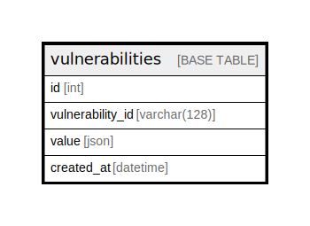

# vulnerabilities

## Description

vulnerabilities obtained via Trivy DB

<details>
<summary><strong>Table Definition</strong></summary>

```sql
CREATE TABLE `vulnerabilities` (
  `id` int(11) NOT NULL AUTO_INCREMENT,
  `vulnerability_id` varchar(25) NOT NULL,
  `value` json NOT NULL,
  `created_at` datetime NOT NULL DEFAULT CURRENT_TIMESTAMP,
  PRIMARY KEY (`id`),
  KEY `v_vulnerability_id_idx` (`vulnerability_id`) USING BTREE
) ENGINE=InnoDB AUTO_INCREMENT=[Redacted by tbls] DEFAULT CHARSET=utf8mb4 COMMENT='vulnerabilities obtained via Trivy DB'
```

</details>

## Columns

| Name | Type | Default | Nullable | Children | Parents | Comment |
| ---- | ---- | ------- | -------- | -------- | ------- | ------- |
| id | int(11) |  | false |  |  |  |
| vulnerability_id | varchar(25) |  | false |  |  | Vulnerability ID |
| value | json |  | false |  |  | Vulnerability data |
| created_at | datetime | CURRENT_TIMESTAMP | false |  |  |  |

## Constraints

| Name | Type | Definition |
| ---- | ---- | ---------- |
| PRIMARY | PRIMARY KEY | PRIMARY KEY (id) |

## Indexes

| Name | Definition |
| ---- | ---------- |
| v_vulnerability_id_idx | KEY v_vulnerability_id_idx (vulnerability_id) USING BTREE |
| PRIMARY | PRIMARY KEY (id) USING BTREE |

## Relations



---

> Generated by [tbls](https://github.com/k1LoW/tbls)
