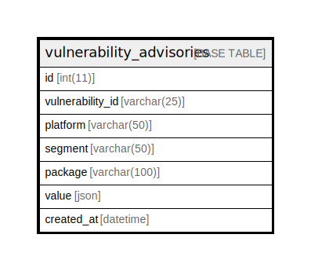

# vulnerability_advisories

## Description

vulnerability advisories obtained via Trivy DB

<details>
<summary><strong>Table Definition</strong></summary>

```sql
CREATE TABLE `vulnerability_advisories` (
  `id` int NOT NULL AUTO_INCREMENT,
  `vulnerability_id` varchar(128) NOT NULL,
  `platform` varchar(50) NOT NULL,
  `segment` varchar(50) NOT NULL,
  `package` varchar(100) NOT NULL,
  `value` json NOT NULL,
  `created_at` datetime NOT NULL DEFAULT CURRENT_TIMESTAMP,
  PRIMARY KEY (`id`),
  KEY `va_vulnerability_advisories_idx` (`vulnerability_id`,`platform`,`segment`,`package`) USING BTREE,
  KEY `va_vulnerability_id_idx` (`vulnerability_id`) USING BTREE,
  KEY `va_platform_idx` (`platform`) USING BTREE,
  KEY `va_source_idx` (`platform`,`segment`) USING BTREE,
  KEY `va_source_package_idx` (`platform`,`segment`,`package`) USING BTREE
) ENGINE=InnoDB AUTO_INCREMENT=[Redacted by tbls] DEFAULT CHARSET=utf8mb4 COLLATE=utf8mb4_0900_ai_ci COMMENT='vulnerability advisories obtained via Trivy DB'
```

</details>

## Columns

| Name | Type | Default | Nullable | Extra Definition | Children | Parents | Comment |
| ---- | ---- | ------- | -------- | ---------------- | -------- | ------- | ------- |
| id | int |  | false | auto_increment |  |  |  |
| vulnerability_id | varchar(128) |  | false |  |  |  | Vulnerability ID |
| platform | varchar(50) |  | false |  |  |  | Platform name ( ex. 'ubuntu', 'GitHub Security Advisory' ) |
| segment | varchar(50) |  | false |  |  |  | Platform segment ( ex. '18.04', 'Rubygems' ) |
| package | varchar(100) |  | false |  |  |  | Package name ( ex. 'apache', 'actionpack' ) |
| value | json |  | false |  |  |  | Advisory data |
| created_at | datetime | CURRENT_TIMESTAMP | false | DEFAULT_GENERATED |  |  |  |

## Constraints

| Name | Type | Definition |
| ---- | ---- | ---------- |
| PRIMARY | PRIMARY KEY | PRIMARY KEY (id) |

## Indexes

| Name | Definition |
| ---- | ---------- |
| va_platform_idx | KEY va_platform_idx (platform) USING BTREE |
| va_source_idx | KEY va_source_idx (platform, segment) USING BTREE |
| va_source_package_idx | KEY va_source_package_idx (platform, segment, package) USING BTREE |
| va_vulnerability_advisories_idx | KEY va_vulnerability_advisories_idx (vulnerability_id, platform, segment, package) USING BTREE |
| va_vulnerability_id_idx | KEY va_vulnerability_id_idx (vulnerability_id) USING BTREE |
| PRIMARY | PRIMARY KEY (id) USING BTREE |

## Relations



---

> Generated by [tbls](https://github.com/k1LoW/tbls)
