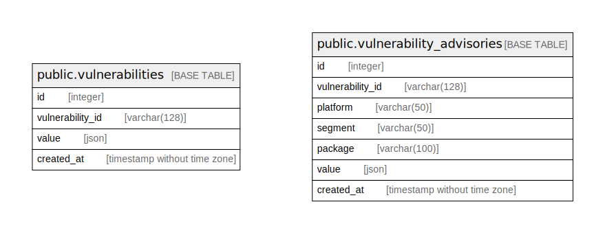

# vulnerability information obtained via Trivy DB

## Tables

| Name | Columns | Comment | Type |
| ---- | ------- | ------- | ---- |
| [public.vulnerabilities](public.vulnerabilities.md) | 4 | vulnerabilities obtained via Trivy DB | BASE TABLE |
| [public.vulnerability_advisories](public.vulnerability_advisories.md) | 7 | vulnerability advisories obtained via Trivy DB | BASE TABLE |

## Relations

---

> Generated by [tbls](https://github.com/k1LoW/tbls)
