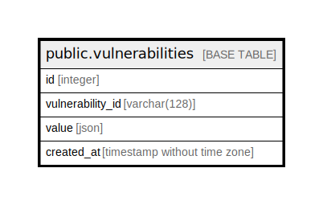

# public.vulnerabilities

## Description

vulnerabilities obtained via Trivy DB

## Columns

| Name | Type | Default | Nullable | Children | Parents | Comment |
| ---- | ---- | ------- | -------- | -------- | ------- | ------- |
| id | integer | nextval('vulnerabilities_id_seq'::regclass) | false |  |  |  |
| vulnerability_id | varchar(25) |  | false |  |  | Vulnerability ID |
| value | json |  | false |  |  | Vulnerability data |
| created_at | timestamp without time zone | CURRENT_TIMESTAMP | false |  |  |  |

## Constraints

| Name | Type | Definition |
| ---- | ---- | ---------- |
| vulnerabilities_pkey | PRIMARY KEY | PRIMARY KEY (id) |

## Indexes

| Name | Definition |
| ---- | ---------- |
| vulnerabilities_pkey | CREATE UNIQUE INDEX vulnerabilities_pkey ON public.vulnerabilities USING btree (id) |
| v_vulnerability_id_idx | CREATE INDEX v_vulnerability_id_idx ON public.vulnerabilities USING btree (vulnerability_id) |

## Relations

---

> Generated by [tbls](https://github.com/k1LoW/tbls)
