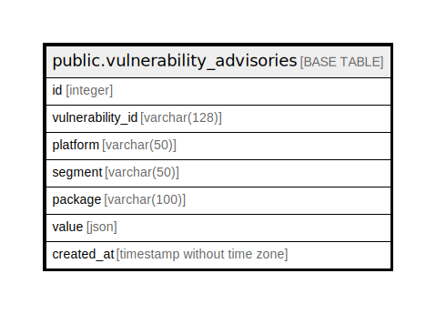

# public.vulnerability_advisories

## Description

vulnerability advisories obtained via Trivy DB

## Columns

| Name | Type | Default | Nullable | Children | Parents | Comment |
| ---- | ---- | ------- | -------- | -------- | ------- | ------- |
| id | integer | nextval('vulnerability_advisories_id_seq'::regclass) | false |  |  |  |
| vulnerability_id | varchar(25) |  | false |  |  | Vulnerability ID |
| platform | varchar(50) |  | false |  |  | Platform name ( ex. 'ubuntu', 'GitHub Security Advisory' ) |
| segment | varchar(50) |  | false |  |  | Platform segment ( ex. '18.04', 'Rubygems' ) |
| package | varchar(100) |  | false |  |  | Package name ( ex. 'apache', 'actionpack' ) |
| value | json |  | false |  |  | Advisory data |
| created_at | timestamp without time zone | CURRENT_TIMESTAMP | false |  |  |  |

## Constraints

| Name | Type | Definition |
| ---- | ---- | ---------- |
| vulnerability_advisories_pkey | PRIMARY KEY | PRIMARY KEY (id) |

## Indexes

| Name | Definition |
| ---- | ---------- |
| vulnerability_advisories_pkey | CREATE UNIQUE INDEX vulnerability_advisories_pkey ON public.vulnerability_advisories USING btree (id) |
| va_vulnerability_advisories_idx | CREATE INDEX va_vulnerability_advisories_idx ON public.vulnerability_advisories USING btree (vulnerability_id, platform, segment, package) |
| va_vulnerability_id_idx | CREATE INDEX va_vulnerability_id_idx ON public.vulnerability_advisories USING btree (vulnerability_id) |
| va_platform_idx | CREATE INDEX va_platform_idx ON public.vulnerability_advisories USING btree (platform) |
| va_source_idx | CREATE INDEX va_source_idx ON public.vulnerability_advisories USING btree (platform, segment) |
| va_source_package_idx | CREATE INDEX va_source_package_idx ON public.vulnerability_advisories USING btree (platform, segment, package) |

## Relations

---

> Generated by [tbls](https://github.com/k1LoW/tbls)
