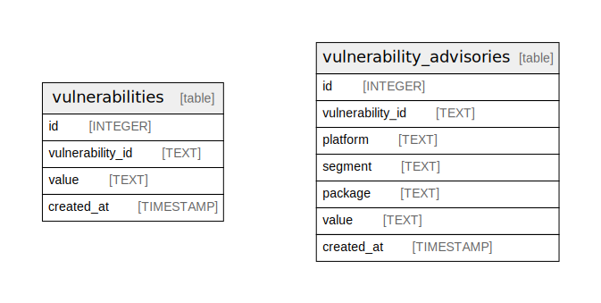

# vulnerability information obtained via Trivy DB

## Tables

| Name | Columns | Comment | Type |
| ---- | ------- | ------- | ---- |
| [vulnerabilities](vulnerabilities.md) | 4 |  | table |
| [vulnerability_advisories](vulnerability_advisories.md) | 7 |  | table |

## Relations

---

> Generated by [tbls](https://github.com/k1LoW/tbls)
