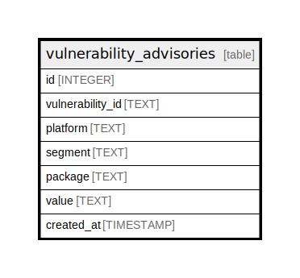

# vulnerability_advisories

## Description

<details>
<summary><strong>Table Definition</strong></summary>

```sql
CREATE TABLE vulnerability_advisories (
        id INTEGER PRIMARY KEY AUTOINCREMENT,
        vulnerability_id TEXT NOT NULL,
        platform TEXT NOT NULL,
        segment TEXT NOT NULL,
        package TEXT NOT NULL,
        value TEXT NOT NULL,
        created_at TIMESTAMP DEFAULT CURRENT_TIMESTAMP
    )
```

</details>

## Columns

| Name | Type | Default | Nullable | Children | Parents | Comment |
| ---- | ---- | ------- | -------- | -------- | ------- | ------- |
| id | INTEGER |  | true |  |  |  |
| vulnerability_id | TEXT |  | false |  |  | Vulnerability ID |
| platform | TEXT |  | false |  |  | Platform name ( ex. 'ubuntu', 'GitHub Security Advisory' ) |
| segment | TEXT |  | false |  |  | Platform segment ( ex. '18.04', 'Rubygems' ) |
| package | TEXT |  | false |  |  | Package name ( ex. 'apache', 'actionpack' ) |
| value | TEXT |  | false |  |  | Advisory data |
| created_at | TIMESTAMP | CURRENT_TIMESTAMP | true |  |  |  |

## Constraints

| Name | Type | Definition |
| ---- | ---- | ---------- |
| id | PRIMARY KEY | PRIMARY KEY (id) |

## Indexes

| Name | Definition |
| ---- | ---------- |
| va_source_package_idx | CREATE INDEX va_source_package_idx ON vulnerability_advisories(platform, segment, package) |
| va_source_idx | CREATE INDEX va_source_idx ON vulnerability_advisories(platform, segment) |
| va_platform_idx | CREATE INDEX va_platform_idx ON vulnerability_advisories(platform) |
| va_vulnerability_id_idx | CREATE INDEX va_vulnerability_id_idx ON vulnerability_advisories(vulnerability_id) |
| va_vulnerability_advisories_idx | CREATE INDEX va_vulnerability_advisories_idx ON vulnerability_advisories(vulnerability_id, platform, segment, package) |

## Relations



---

> Generated by [tbls](https://github.com/k1LoW/tbls)
